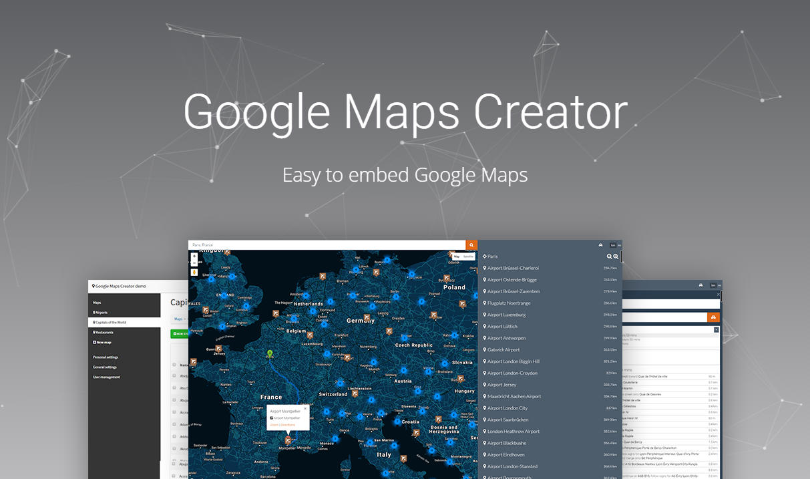

# Google Maps Creator
**Easy to embed and manage Google Maps.**

Visit https://nowsquare.com/google-maps-creator for a demo.



## One Management for all your Google Maps

Whether you need a map for a contact form map or a map with multiple points of interest, with Google Maps Creator you can manage all the maps of your clients from one location.

It's multi user so you can give your customers their own login. They will be able to manage all their maps with their own account.

 - Easy to install and use
 - Multi user with registration
 - Unlimited users and Google Maps
 - Search and get directions
 - Multi language
 - Responsive design
 - Choose from multiple themes
 - Many marker images included
 - Multiple map styles included
 - Labels to filter results
 - Import CSV files
 - Works with SQLite and MySQL


## System requirements

Make sure your server meets the requirements below. Most of the PHP libraries are installed by default.

 - PHP >= 5.4
   - MCrypt PHP Extension
   - PHP SQLite3 PDO
 - Apache mod_rewrite
 - MySQL (optional)

## Installation

### Upload files

Upload all files to the webroot of your hosting account.

### Directory permissions

The `/app/storage/` directory and all underlying files and directories need write permissions.

 - /app/storage/cache/
 - /app/storage/logs/
 - /app/storage/meta/
 - /app/storage/meta/services.json
 - /app/storage/sessions/
 - /app/storage/uploads/
 - /app/storage/views/
 - /app/database/
 - /app/database/production.sqlite

### Encryption key
In order to improve security, open `/app/config/app.php`, look for the `key` setting and change the random string. Make sure you only use letters (uppercase or lowercase) and numbers.

```php
/*
 |--------------------------------------------------------------------------
 | Encryption Key
 |--------------------------------------------------------------------------
 |
 | This key is used by the Illuminate encrypter service and should be set
 | to a random, 32 character string, otherwise these encrypted strings
 | will not be safe. Please do this before deploying an application!
 |
 */

'key' => 'mcMTR7QLdDycOEmf2JAtyqy942cbhIqO',
```

### Google Maps API key

Get your Google Maps API key here and enter it in `/app/config/production/google.php`.

### Database

Google Maps Creator works out of the box with an SQLite database. However, if you want to use a MySQL database this is possible, too.
If you want to use a MySQL database, create one on your server. Open the file `/app/config/production/database.php` and change `'default' => 'sqlite'` to `'default' => 'mysql'`. Enter the database name, username and password at the lines below.

You can leave the SQLite reference intact, only change the default driver. Now `/app/config/production/database.php` looks something like:

```php
return array(

	'default' => 'mysql',
	'connections' => array(

		'mysql' => array(
			'driver'    => 'mysql',
			'host'      => 'localhost',
			'database'  => 'database_name',
			'username'  => 'user',
			'password'  => 'pass',
		),

		'sqlite' => array(
			'database' => app_path() .'/database/production.sqlite',
		),
	),

);
```

When you open the url where Google Maps Creator is installed for the first time, the database content will be generated.

### Email configuration

For the configuration on how automated mails like registration and lost password are sent, open `/app/config/production/mail.php`. The file should be self-explanatory:

### First login

After you've installed Google Maps Creator, visit the URL where you've installed it (e.g. http://website.com/login) and login with the following credentials:

E-mail: info@example.com
Password: welcome

## Special thanks
Special thanks go to the following resources:

### PHP

 - http://laravel.com
 - https://packagist.org/
 - http://anahkiasen.github.io/former/
 - http://geocoder-php.org/
 - https://github.com/egeloen/ivory-google-map

### HTML / CSS

 - http://getbootstrap.com/
 - http://bootswatch.com/

### JavaScript

 - http://jquery.com/
 - http://ivaynberg.github.io/select2/
 - http://hackerwins.github.io/summernote/
 - https://github.com/carhartl/jquery-cookie
 - http://bite-software.co.uk/shards/
 - http://cameronspear.com/demos/bootstrap-hover-dropdown/
 - http://handsontable.com/
 - http://areaaperta.com/nicescroll/
 - http://public.jquery-bootgrid.com/

### Images

 - http://fontawesome.io/
 - http://mapicons.nicolasmollet.com
 - http://public.icons-land.com

### Other

 - https://snazzymaps.com/

## License
Google Maps Creator
Copyright (C) 2016 NowSquare

This program is free software: you can redistribute it and/or modify
it under the terms of the GNU General Public License as published by
the Free Software Foundation, either version 3 of the License, or
(at your option) any later version.